# SALFREEZE-Ecommerce-Sales-Analysis-from-2014-to-2018-business-Year

# SALFREEZE E-COMMERCE

## Introduction
#### Established in 2014, Salfreeze is a notable brand for ecommerce trade. Its main ecommerce trade focuses on technology, home and office, furniture and appliances, phones and laptops. After a few years of its market debut, an analysis was carried out by its financial department to ascertain the level of progress of the business from the year of establishment (2014) to the current year (2018).
---
---

## Features used in the analysis
#### Formulas and Conditional statements as well as pivot tables were used for the breakdown of data. The data was further presented using graphical features for a more concise analysis.

## Objectives
#### 1.	To Determine the Total and Average Revenue.
#### 2.	To Determine the Total Profit and Profit Margin.
#### 3.	To Determine the Total Quantity of Goods Sold.
#### 4.	To Determine the State with The Highest Profit and State with The Lowest Profit.
#### 5.	To Determine the Top 5 Gainers, The Five States with The Highest Number of Orders, 5 Most Ordered Products and Their Categories, Profits Made in Each Year as Well as The Number of Orders Made Each Year.
---

TOP 5 GAINERS ON PIVOT                      | 		      TOP 5 GAINERS ON CHART                 
:---------------------------------------------:	         |		:----------------------------------------:
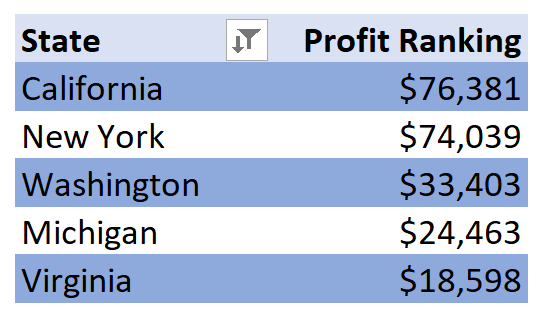 	     		         | 		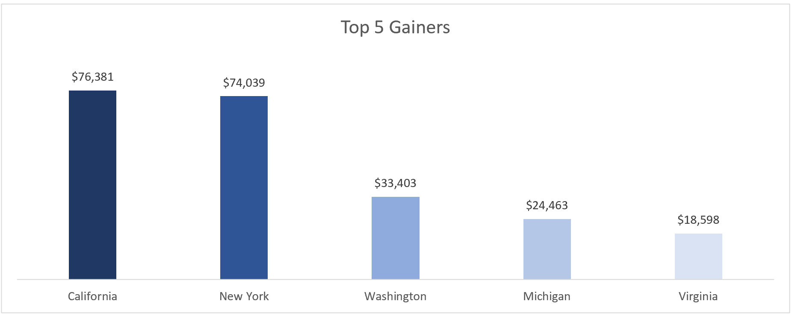
TOP 5 STATES BY ORDER ON PIVOT        	         | 		TOP 5 STATES BY ORDER ON CHART         
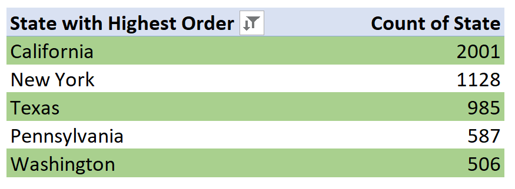 			         |		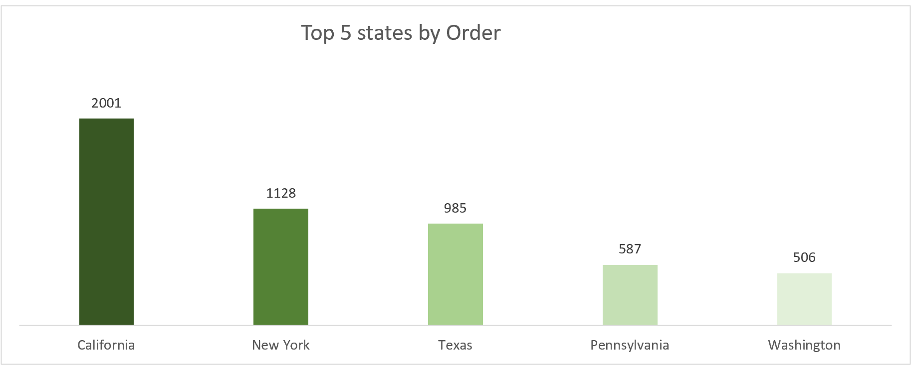
TOP 5 MOST ORDERED PRODUCT ON PIVOT    | 		TOP 5 MOST ORDERED PRODUCT ON CHART    
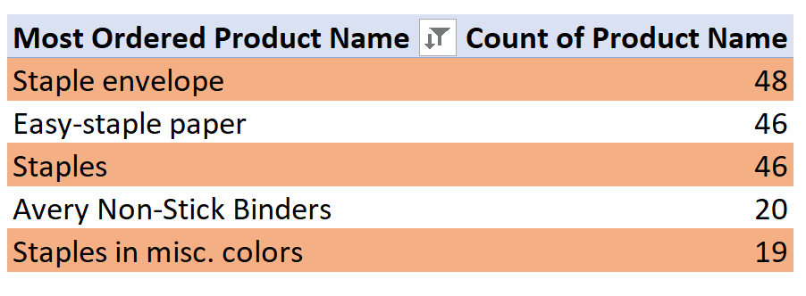 		          |			 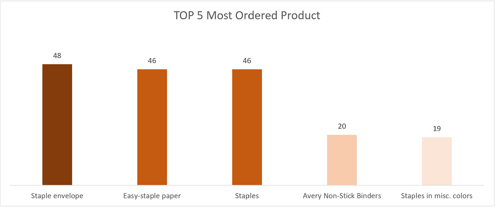
MOST ORDERED CATEGORY ON PIVOT             | 		MOST ORDERED CATEGORY ON CHART
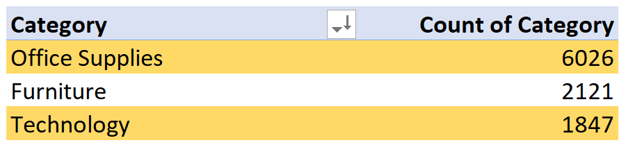 	         |			 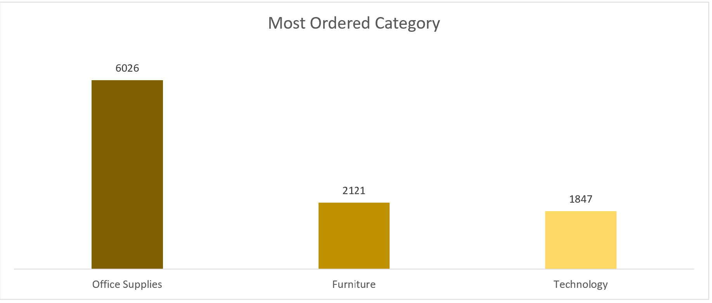
PROFITS FROM 2014 TO 2018 ON PIVOT          | 		PROFITS FROM 2014 TO 2018 ON CHART
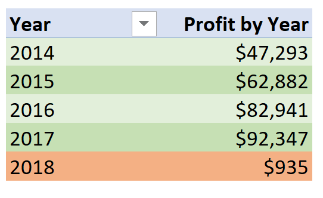 			         |			 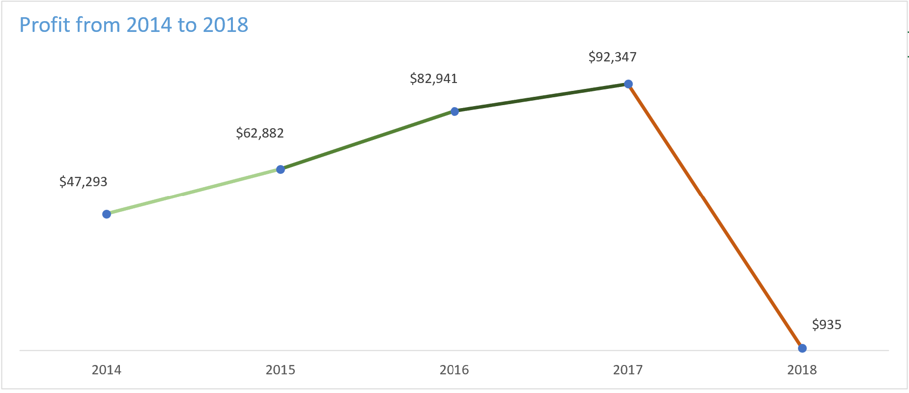
NUMBER OF SHIPPINGS BY YEAR ON PIVOT     | 		NUMBER OF SHIPPINGS BY YEAR ON CHART
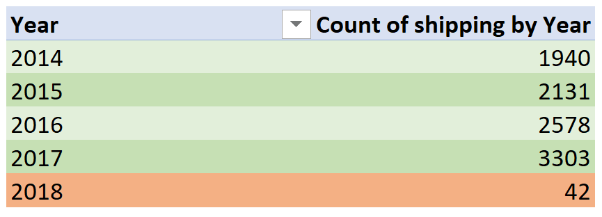 			         |			 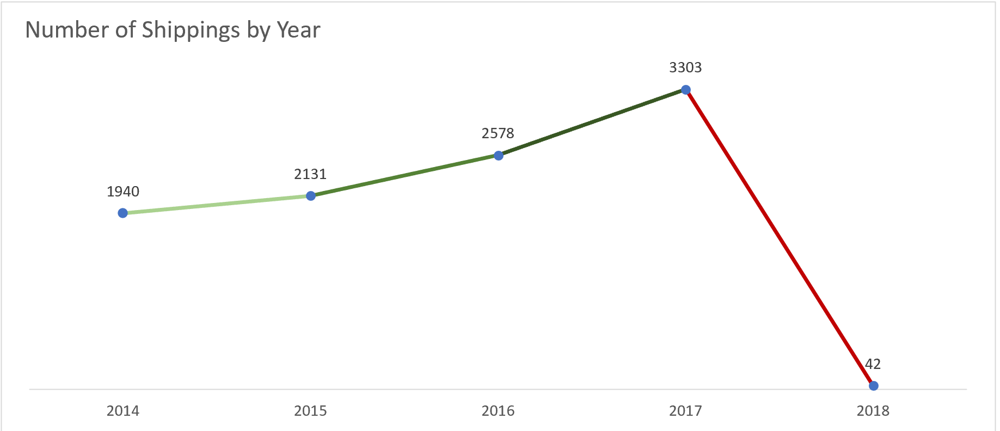

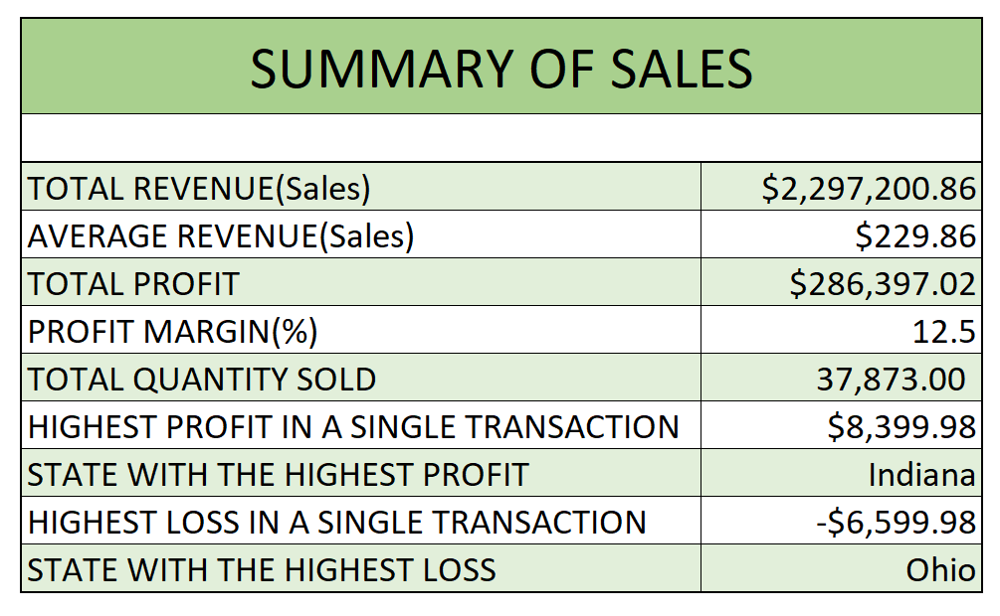

---
---
# Observations 

### The above data shows that; 
#### The period recorded a total profit of $286,397 with California as the Top Gainer with a profit of $76,381 with New York settled closely at $74,039 on the second position.
#### California also took first position on the top 5 states with the highest Order with a total order count of 2001 items.
#### “Staple Envelop” is the most Ordered product from the store with a total of 48 items. The “Easy-staple-paper” and the “Staples” products clinched the second and third position with a total of 46 products each.
#### It is No Brainer that the Office Supplies cliched the first position on the most ordered items by Category seeing that the top 5 most ordered products fall under the Office Supplies category.
#### Between 2014 and 2017 the profit increased exponentially from $47,293 to $92,347 and fell to $935 in the following year 2018.
#### Similarly, the number of Shipping increased exponentially from 1940 to 3303 items between 2014 and 2019 and a sharp fall to 42 items was recorded in the year 2018.
#### The state of Indiana recorded the highest profut of $8,399.98 while ohio records a loss of -$6,599.98. in a single transaction.
---
---
# Comments and Recommendations
#### The business recorded a fast growth in its first four years in the market by making a remarkable Profit Margin of 12.5%.
#### However, there was a great decline in profit in 2018 which on observation was said to be from the fact that there was a sharp decline in the number of items ordered and shipped across the country in 2018.
#### The Company should carry out a customer survey to get customer satisfaction feedback. It could help to know the reason why there was a fall in the number of items ordered in 2018.
---
---

